<!-- ===== ANIMATED TERMINAL BANNER ===== -->

  

<!-- ===== SOCIAL BADGES ===== -->

  
  
  
  
  

<!-- ===== ABOUT ===== -->
## About Me

I'm a **7th-semester Informatics Engineering student** at **Perbanas Institute Jakarta** with a deep interest in **cyber security**. I enjoy dissecting system vulnerabilities and building web applications that are secure from the ground up. That journey led me into **blockchain**, where I explore **smart contracts in the Ethereum ecosystem** and treat security not as a feature, but as the foundation. Right now I'm sharpening my **secure-coding** and **smart-contract auditing** skills.

- Currently focused on **secure coding** & **smart contract auditing**
- Exploring **Solidity**, **Web3**, and the **Ethereum** ecosystem
- Open to **internships**, **freelance**, and **full-time** opportunities
- Reach me at **inijudika@gmail.com**

<!-- ===== SKILLS ===== -->
## Tech Arsenal

<table align="center" border="0" cellpadding="10">
  <tr>
    <td align="right" width="150"><b>Languages</b></td>
    <td align="center" width="78"> <b>Python</b></td>
    <td align="center" width="78"> <b>JavaScript</b></td>
    <td align="center" width="78"> <b>TypeScript</b></td>
    <td align="center" width="78"> <b>Solidity</b></td>
    <td align="center" width="78"> <b>PHP</b></td>
  </tr>
  <tr>
    <td align="right"><b>Frontend</b></td>
    <td align="center"> <b>React</b></td>
    <td align="center"> <b>Tailwind</b></td>
    <td align="center"> <b>HTML</b></td>
    <td align="center"> <b>CSS</b></td>
    <td align="center"> <b>Vite</b></td>
  </tr>
  <tr>
    <td align="right"><b>Backend</b></td>
    <td align="center"> <b>Node.js</b></td>
    <td align="center"> <b>Express</b></td>
    <td align="center"> <b>Laravel</b></td>
    <td align="center"> <b>FastAPI</b></td>
    <td align="center"> <b>Web3.py</b></td>
  </tr>
  <tr>
    <td align="right"><b>DevOps &amp; Data</b></td>
    <td align="center"> <b>Docker</b></td>
    <td align="center"> <b>PostgreSQL</b></td>
    <td align="center"> <b>MySQL</b></td>
    <td align="center"> <b>Git</b></td>
    <td align="center"> <b>GitHub</b></td>
  </tr>
  <tr>
    <td align="right"><b>Security &amp; Systems</b></td>
    <td align="center"> <b>Linux</b></td>
    <td align="center"> <b>Kali</b></td>
    <td align="center"> <b>Bash</b></td>
    <td align="center"> <b>Burp Suite</b></td>
    <td align="center"> <b>Wireshark</b></td>
  </tr>
</table>

<!-- ===== EDUCATION ===== -->
## Education

<table>
  <tr>
    <td valign="top" width="50%">
      <h3>Perbanas Institute Jakarta</h3>
      
<b>B.Sc. Informatics Engineering</b> &nbsp;·&nbsp; <code>2023 — Present</code>

      
Focused on network security, secure programming, and software development in information technology.

    </td>
    <td valign="top" width="50%">
      <h3>PBD Aviation Vocational High School, Medan</h3>
      
<b>Vocational — Electrical Avionic</b> &nbsp;·&nbsp; <code>2020 — 2023</code>

      
Specialized in aircraft electrical systems and avionics, building a strong technical foundation.

    </td>
  </tr>
</table>

<!-- ===== PROJECTS ===== -->
## Featured Projects

<table>
  <tr>
    <td width="33%" valign="top">
      <h3 align="center">Younglings</h3>
      

      
A Solidity smart-contract auditing tool that detects reentrancy, integer overflow, and unauthorized-access vulnerabilities.

    </td>
    <td width="33%" valign="top">
      <h3 align="center"><a href="https://github.com/JudikaM/warungku-app">Warungku</a></h3>
      

      
A complete food-delivery app — Node.js & Express backend on Firebase, with React + Vite customer frontend and admin dashboard.

    </td>
    <td width="33%" valign="top">
      <h3 align="center">NakamotoX</h3>
      

      
A microservices education app visualizing ChaCha20 & Caesar Cipher encryption in real-time, down to bitwise (ARX) operations.

    </td>
  </tr>
</table>

<!-- ===== STATS ===== -->
## GitHub Stats

  

<!-- ===== ACTIVITY GRAPH ===== -->

  

<!-- ===== SNAKE ANIMATION ===== -->

  <picture>
    <source media="(prefers-color-scheme: dark)" srcset="https://raw.githubusercontent.com/JudikaM/JudikaM/output/github-snake-dark.svg" />
    <source media="(prefers-color-scheme: light)" srcset="https://raw.githubusercontent.com/JudikaM/JudikaM/output/github-snake.svg" />
    
  </picture>

<!-- ===== FOOTER ===== -->

  

